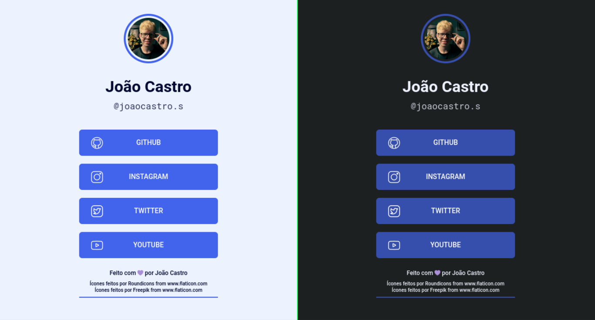

<h1 align="center">
  🔗 <b>Rocket Links</b>
</h1>

  

## 💻 O que é?

Rocket Links é um projeto para compartilhar diversos links em um único link.

## 💡 Como acessar?

Você pode acessar o projeto através do link [joaofbcastro.github.io/RocketLinks](https://joaofbcastro.github.io/RocketLinks)

## 🚀 Tecnologias

Esse projeto foi desenvolvido com as seguintes tecnologias:

- HTML
- CSS

## 🔖 Sobre o Layout

Você pode visualizar o layout proposto pelo projeto [clicando aqui](https://efficient-sloth-d85.notion.site/Maratona-Explorer-2-0-7ed52d87338e472e9fc7c25180ca933f).

---

Este projeto foi desenvolvido durante a **[Maratona Explorer 2.0](https://lp.rocketseat.com.br/inscricao/maratona-explorer)**, realizada pela **[@Rocketseat 💜](https://github.com/Rocketseat)**.
